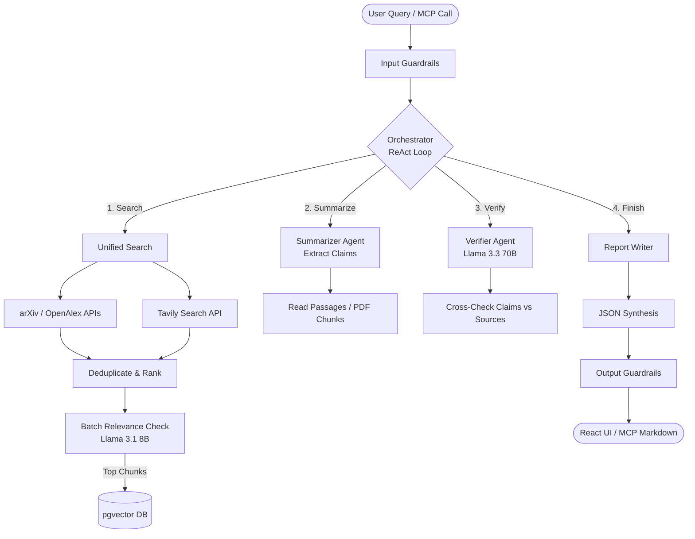

# Cove

Cove is a multi-agent AI research assistant that performs query-focused literature reviews, web searches, and citation verification. It retrieves academic papers (arXiv, OpenAlex) and web pages (Tavily), extracts factual claims, and verifies them directly against source passages to prevent hallucinations. 

Cove runs as both a web application and a Model Context Protocol (MCP) server.

---

## Architecture

Cove coordinates multiple specialized agents using a ReAct (Reasoning and Action) orchestration loop.

### System Diagram



### Execution Flow
1. **Input Guard**: The query is validated for safety via a Groq-hosted safety model.
2. **ReAct Loop (Orchestrator)**: Evaluates what info is missing, selecting tools dynamically:
   - **`search_query`**: Searches databases. Runs local `bge-small-en-v1.5` embeddings to rank matches, filters the top 8 candidates using a batched Llama 3.1 relevance audit, and indexes contents into `pgvector` (if deep research is enabled).
   - **`summarize_sources`**: Scrapes pages/PDFs and extracts factual claims.
   - **`verify_claims`**: Evaluates all claims in a single batch call per paper using Llama 3.3 70B to assign confidence states (Supported, Contradicted, etc.).
3. **Report Generation**: Synthesizes verified claims into a markdown report containing:
   - **Contradiction Detection**: Conflicting viewpoints across papers.
   - **Research Gaps**: Missing information in the literature.
   - **Evidence Graph**: A citation matrix mapping claims to source URLs.

---

## MCP Server Integration

Cove exposes its research pipeline as an MCP server. You can integrate it with Claude Desktop or any MCP-compatible client.

### MCP Tools

| Tool Name | Description | Key Arguments |
| :--- | :--- | :--- |
| `run_research` | Runs the full research pipeline and outputs a cited Markdown survey. | `query` (string), `deepResearch` (bool) |
| `unified_search` | Searches academic + web databases, deduplicates, and semantically ranks. | `query` (string) |
| `scrape_url` | Downloads any web page or PDF and extracts clean readable text. | `url` (string) |
| `store_document` | Scrapes, chunks, embeds, and indexes a URL into the local vector DB. | `url` (string) |
| `query_knowledge_base` | Queries the local pgvector store for matching text chunks. | `query` (string), `k` (int) |

### Claude Desktop Configuration

Add this to your Claude Desktop configuration file (typically `C:\Users\<username>\AppData\Roaming\Claude\claude_desktop_config.json` on Windows or `~/Library/Application Support/Claude/claude_desktop_config.json` on macOS):

```json
{
  "mcpServers": {
    "cove": {
      "command": "node",
      "args": ["C:\\...\\cove\\backend\\mcp-server.js/cove/backend/mcp-server.js"]
    }
  }
}
```
 
Cove automatically loads environment variables (including API keys and DB URLs) from the local `backend/.env` file relative to the script path. You do not need to expose your keys in the Claude configuration file.

---

## Local Development Setup

### Prerequisites
- Node.js 18+
- PostgreSQL with `pgvector` extension (optional, required for deep research RAG)

### Setup Steps

1. **Get API Keys**:
   - **Groq**: API key from [console.groq.com](https://console.groq.com)
   - **Gemini**: API key from [aistudio.google.com/app/api-keys](https://aistudio.google.com/app/api-keys)
   - **Tavily**: Search API key from [tavily.com](https://tavily.com)
   - **Firebase**: Set up a Firestore project. Download your admin credentials to `backend/serviceAccountKey.json` and configure Google authentication.

2. **Backend Setup**:
   ```bash
   cd backend
   npm install
   ```
   Create a `backend/.env` file:
   ```env
   GROQ_API_KEY1=your_groq_api_key
   GROQ_API_KEY2=optional_backup_key_1
   GEMINI_API_KEY1=your_gemini_api_key
   GEMINI_API_KEY2=optional_backup_key_1
   GEMINI_API_KEY3=optional_backup_key_2
   TAVILY_API_KEY=your_tavily_key
   DATABASE_URL=your_postgres_db_url
   PORT=8000
   ```
   Start the backend server:
   ```bash
   npm run dev
   ```

3. **Frontend Setup**:
   ```bash
   cd ../frontend
   npm install
   ```
   Create a `frontend/.env` file:
   ```env
   REACT_APP_API_URL=http://localhost:8000
   # Paste your Firebase Client configuration:
   REACT_APP_FIREBASE_API_KEY=...
   REACT_APP_FIREBASE_AUTH_DOMAIN=...
   REACT_APP_FIREBASE_PROJECT_ID=...
   REACT_APP_FIREBASE_STORAGE_BUCKET=...
   REACT_APP_FIREBASE_MESSAGING_SENDER_ID=...
   REACT_APP_FIREBASE_APP_ID=...
   ```
   Start the frontend React app:
   ```bash
   npm run dev
   ```

---

## Codebase Map

```
cove/
├── backend/
│   ├── agents/            # Orchestrator ReAct loop & report generator
│   ├── db/                # Neon/Drizzle schema definitions & loaders
│   ├── guardrails/        # Content safety policy checks
│   ├── ranking/           # Local ONNX semantic ranking algorithms
│   ├── retrieval/         # Academic/web crawlers & vector store integrations
│   ├── utils/             # Rotated Groq/Gemini API clients
│   ├── verification/      # Citation claim checking engines
│   ├── mcp-server.js      # Stdio MCP entrypoint
│   └── index.js           # HTTP/SSE Express server entrypoint
└── frontend/
    ├── public/            
    └── src/
        ├── components/    
        ├── hooks/         
        └── theme.js       # Design tokens & styles
```
